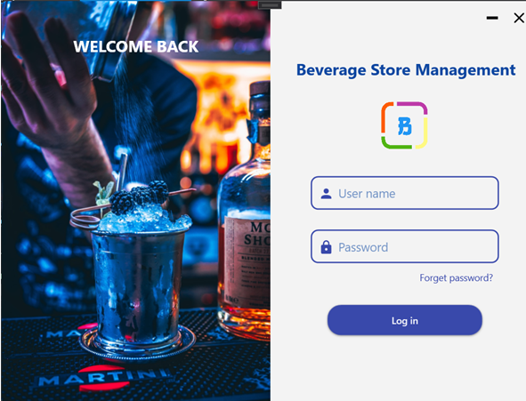
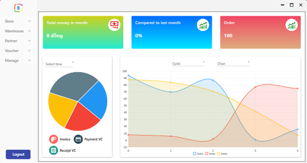
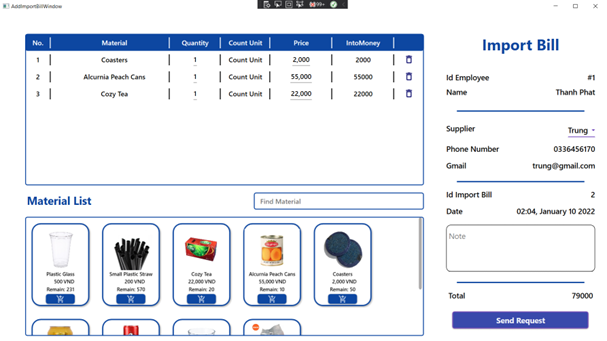
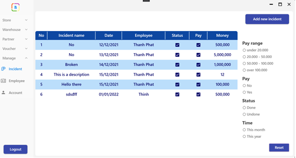

# Beverage Store Management
> Nowadays, there are several beverage stores to meet people's requirements for refreshments such as coffee, smoothies, and tea. Stores face numerous challenges as the number of visitors grows, particularly in accounting, service, dispensing, and inventory management. The door owner wants to take advantage of the advancement of information technology to gradually computerize the management stages in order to service clients better, more precisely, and more rapidly.

## Table of Contents
* [General Info](#general-information)
* [Technologies Used](#technologies-used)
* [Features](#features)
* [Screenshots](#screenshots)
* [Setup](#setup)
* [Project Status](#project-status)
* [Room for Improvement](#room-for-improvement)
* [Contact](#contact)
<!-- * [License](#license) -->

## General Information
- Reduce the volume of notes to store information.
- Update data quickly, accurately, and timely.
- Make statistics of the number of goods imported and exported, revenue and expenditure, and the revenue situation of the door row.
- Automatically print the necessary invoices such as import requisition form, import.
invoice, receipts, and payments.
- Ability to store long-term information, ensuring quick query when needed.

## Technologies Used
- .NET FrameWork 4.7.2.
- Azure SQL Database.
- Windows Presentation Foundation (WPF)

## Features
List the ready features here:
- Sales statistics.
- Sales function.
- Product and material management.
- Supplier management.
- Payment voucher and Receipt voucher management.
- Incident management.
- Employee management.
- Account management.

## Screenshots
- Login screenshot.

- Home screenshot.

- Import Bill screenshot.

- Incident screenshot.

## Setup
- Install .NET Framework 4.7.2
- Create Database in Azure and run SqlQuery file.
- Change connection to database.

## Project Status
Project is: _no longer being worked on_

## Room for Improvement
Include areas you believe need improvement / could be improved. Also add TODOs for future development.

Room for improvement:
- Improve sales function.
- Improve login function.

To do:
- Customer management.

## Contact
Created by [Thanh Phat](https://github.com/thanhphat219) -  [Huu Thinh](https://github.com/JohnyHo-art) - [Duc Trung](https://github.com/leductrung2310) - feel free to contact us!